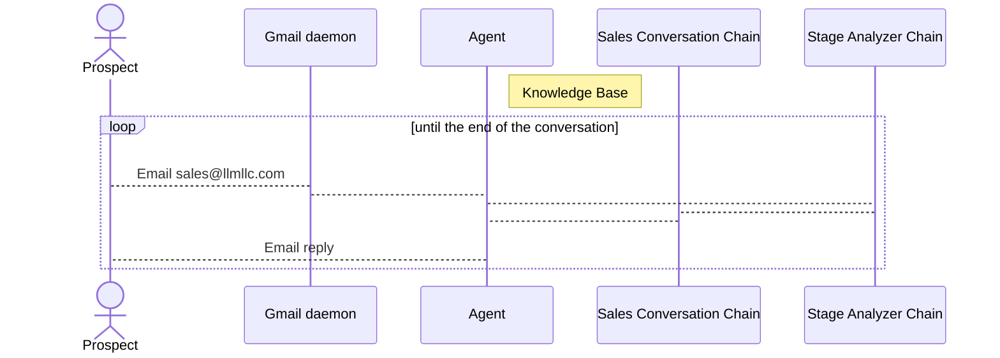

# LLM LLC - Large Langugage Model Assisted Autonomous Sales Agent

## Architecture

Built using [`LangChain`](https://github.com/langchain-ai/langchain) library. Inspired by [BabyAGI](https://github.com/yoheinakajima/babyagi) architecture and SalesGPT project.

## Knowledge base

1. Product/Service Catalog - kb/product_catalog.txt
2. Funnel stages - kb/stages.json
3. Agent configuration - kb/agent_config.json
4. Prompts - kb/prompts

## Installation

Make sure your have a python 3.10+ and run:

`pip install -r requirements.txt`

Create `.env` file and put your Open AI Key there: 

`OPENAI_API_KEY=sk-xxx`

Run:

`python run.py`
